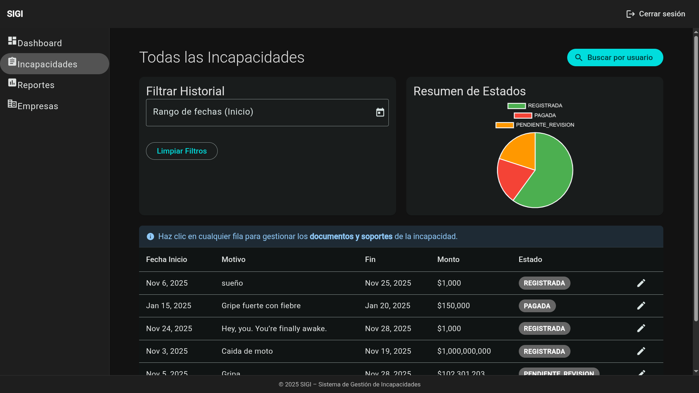
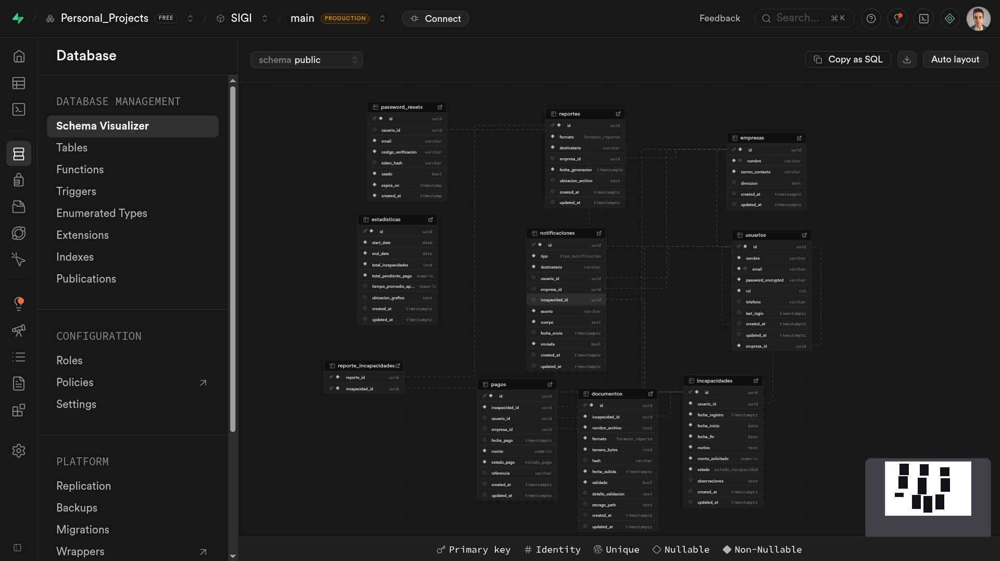
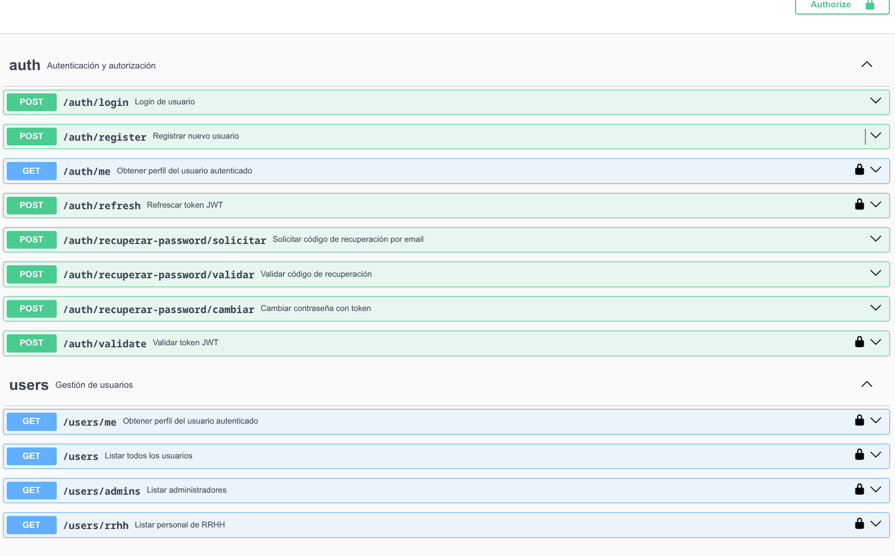

# SIGI – Medical Leave Management System

<div align="center">


[](#-license)

**A full-stack enterprise web platform for managing medical leave records, document handling, and HR analytics.**

[Features](#-key-features) • [Architecture](#-architecture) • [Tech Stack](#-technology-stack) • [Getting Started](#-getting-started) • [API Documentation](#-api-documentation)

</div>

---

## 📋 Overview

**SIGI** (_Sistema de Gestión de Incapacidades_) is a comprehensive web platform designed to streamline the registration, administration, and tracking of medical leave records within an organization.

The system centralizes information, reduces redundant processes, improves traceability, and provides powerful analytical tools for Human Resources departments.

---

## 📸 Screenshots

<div align="center">


<br><br>

<br><br>


</div>

---

## ✨ Key Features

### 🏥 Core Functionality

- **Medical Leave Registration** – Complete CRUD operations for medical leave records with status workflow management
- **Document Management** – Upload, validate, and store supporting documents with Supabase Storage integration
- **Status Workflow** – Track leave requests through states: _Registered → Accepted → Rejected → Paid_
- **Employee Portal** – Self-service interface for employees to view and manage their leave records

### 📊 Analytics & Reporting

- **Interactive Dashboard** – Real-time statistics with Chart.js visualizations
- **PDF/CSV Reports** – Generate downloadable reports for HR and accounting
- **Email Reports** – Automated report distribution to stakeholders
- **Metrics Tracking** – Monthly leave counts, average processing times, accumulated values

### 🔐 Security & Access Control

- **JWT Authentication** – Secure token-based authentication system
- **Role-Based Authorization** – Granular access control with guards (Admin, HR, Employee)
- **Password Recovery** – Secure password reset flow with email verification
- **Audit Logging** – Complete traceability of critical system activities

### 🔔 Notifications

- **Automated Email Alerts** – Notifications for status changes and important updates
- **HR Alerts** – Alerts for pending actions and deadlines
- **Configurable SMTP** – Support for various email providers (Gmail, SendGrid, etc.)

### 🏢 Multi-Company Support

- **Company Management** – Support for multiple organizations
- **User-Company Relations** – Users scoped to specific companies
- **Company-level Reports** – Isolated data and reporting per organization

---

## 🏗 Architecture

The project follows a **modular monorepo structure** with clear separation of concerns:

```
SIGI/
├── api/                    # Backend (NestJS)
│   ├── src/
│   │   ├── common/         # Shared decorators, guards, filters, pipes
│   │   ├── config/         # App, database, and mail configuration
│   │   ├── database/       # Entities, migrations, seeds
│   │   ├── infraestructure/# External adapters (email, storage, etc.)
│   │   └── modules/        # Business domain modules
│   │       ├── auth/       # Authentication & authorization
│   │       ├── users/      # User management
│   │       ├── employees/  # Employee data management
│   │       ├── incapacities/# Core medical leave logic
│   │       ├── documents/  # Document upload & validation
│   │       ├── reports/    # PDF/CSV report generation
│   │       ├── statistics/ # Analytics & dashboard data
│   │       ├── notifications/# Email notification system
│   │       ├── audit/      # Activity logging
│   │       ├── empresas/   # Company management
│   │       └── integrations/# External system connections
│   └── docs/               # API documentation
│
└── app/                    # Frontend (Angular 20)
    └── src/app/
        ├── core/           # Guards, interceptors, services
        ├── layout/         # Main layout components
        ├── shared/         # Reusable components & utilities
        └── modules/        # Feature modules
            ├── auth/       # Login, register, password recovery
            ├── hr/         # HR dashboard & management
            ├── employment/ # Employee features
            └── companies/  # Company administration
```

### Backend Module Structure

Each backend module follows a clean architecture pattern:

```
/modules/<module-name>/
├── controllers/        # HTTP endpoints
├── services/           # Business logic
├── repositories/       # Database access layer
├── entities/           # ORM models
├── dtos/               # Data transfer objects
├── mappers/            # Entity ↔ DTO transformations
└── <module>.module.ts  # NestJS module definition
```

---

## 🛠 Technology Stack

### Backend (`/api`)

| Technology              | Purpose                                                 |
| ----------------------- | ------------------------------------------------------- |
| **NestJS 11**           | Node.js framework for scalable server-side applications |
| **TypeScript 5.7**      | Type-safe development                                   |
| **Supabase**            | PostgreSQL database & file storage                      |
| **JWT (`@nestjs/jwt`)** | Token-based authentication                              |
| **Swagger/OpenAPI**     | API documentation & testing interface                   |
| **PDFKit**              | PDF report generation                                   |
| **Nodemailer**          | Email sending capabilities                              |
| **Handlebars**          | Email template engine                                   |
| **class-validator**     | Request validation with decorators                      |
| **bcrypt**              | Password hashing                                        |

### Frontend (`/app`)

| Technology                | Purpose                                         |
| ------------------------- | ----------------------------------------------- |
| **Angular 20**            | Modern SPA framework with standalone components |
| **Angular Material**      | UI component library                            |
| **Chart.js + ng2-charts** | Interactive data visualizations                 |
| **RxJS**                  | Reactive programming for async operations       |
| **TypeScript 5.8**        | Type-safe development                           |
| **SCSS**                  | Advanced CSS styling                            |

### Infrastructure

| Technology      | Purpose                                            |
| --------------- | -------------------------------------------------- |
| **Supabase**    | Backend-as-a-Service (PostgreSQL + Storage + Auth) |
| **Node.js 20+** | JavaScript runtime                                 |
| **npm 10+**     | Package management                                 |

---

## 🚀 Getting Started

### Prerequisites

- **Node.js** >= 20.x
- **npm** >= 10.x
- **Git**
- **Supabase** account (for database and storage)

### 1. Clone the Repository

```bash
git clone https://github.com/MateoMor/SIGI.git
cd SIGI
```

### 2. Backend Setup

```bash
# Navigate to backend directory
cd api

# Install dependencies
npm install

# Copy environment template
cp .env.example .env
```

Configure your `.env` file:

```env
# Environment
NODE_ENV=development
PORT=3005

# Supabase (get from your project at supabase.com)
SUPABASE_URL=https://your-project.supabase.co
SUPABASE_SERVICE_ROLE_KEY=your-service-role-key
SUPABASE_ANON_KEY=your-anon-key

# JWT
JWT_SECRET=your-secure-jwt-secret

# Email (optional, for notifications)
MAIL_HOST=smtp.gmail.com
MAIL_PORT=587
MAIL_SECURE=false
MAIL_USER=your-email@gmail.com
MAIL_PASSWORD=your-app-password
MAIL_FROM_NAME=SIGI
MAIL_FROM_EMAIL=noreply@sigi.com
```

Start the development server:

```bash
npm run start:dev
```

### 3. Frontend Setup

```bash
# From project root, navigate to frontend
cd app

# Install dependencies
npm install

# Start development server
npm start
```

### 4. Supabase Configuration

1. Create a project at [supabase.com](https://supabase.com)
2. Run the SQL migrations in order from `api/src/database/migrations/`:
   - `001_initial_schema.sql`
   - `002_add_empresa_to_usuarios.sql`
   - `003_add_unique_constraint_empresa_nombre.sql`
   - `004_make_empresa_id_required.sql`
   - `005_create_password_resets_table.sql`
3. Create a storage bucket named `documentos`
4. Copy your credentials to the `.env` file

---

## 🌐 Default URLs

| Service          | URL                             |
| ---------------- | ------------------------------- |
| **Frontend**     | http://localhost:4200           |
| **Backend API**  | http://localhost:3000           |
| **Swagger Docs** | http://localhost:3000/docs      |
| **OpenAPI JSON** | http://localhost:3000/docs-json |

---

## API Documentation

The API is fully documented with **Swagger/OpenAPI**. Once the backend is running, visit:

- **Interactive Docs**: http://localhost:3000/docs
- **OpenAPI Spec**: http://localhost:3000/docs-json

### Documentation Files

| Document                                                      | Description                                        |
| ------------------------------------------------------------- | -------------------------------------------------- |
| [Backend Architecture](./api/docs/architecture-backend.md)    | Detailed backend structure and module descriptions |
| [Authentication](./api/docs/authentication.md)                | Auth flow, JWT, and security implementation        |
| [Document Upload](./api/docs/documents-upload.md)             | File upload and storage guide                      |
| [Email Service](./api/docs/email-service.md)                  | Email notification configuration                   |
| [Report Generation](./api/docs/descargar-reportes-pdf-csv.md) | PDF/CSV report documentation                       |

---

## 🧪 Testing

### Backend Tests

```bash
cd api

# Unit tests
npm run test

# Watch mode
npm run test:watch

# Coverage report
npm run test:cov

# E2E tests
npm run test:e2e
```

### Frontend Tests

```bash
cd app

# Unit tests
npm test
```

---

## 📂 Project Structure Details

### Backend Modules

| Module          | Description                                    |
| --------------- | ---------------------------------------------- |
| `auth`          | Login, JWT tokens, role-based guards           |
| `users`         | User CRUD, role assignment, profile management |
| `employees`     | Employee data, contracts, personal information |
| `incapacities`  | Core medical leave logic with status workflow  |
| `documents`     | File upload, validation, storage integration   |
| `reports`       | PDF/CSV generation for HR and accounting       |
| `statistics`    | Dashboard metrics and chart data               |
| `notifications` | Automated email alerts and notifications       |
| `audit`         | Activity logging and change history            |
| `empresas`      | Multi-company management                       |
| `integrations`  | Future connections to EPS, ARL systems         |

### Frontend Modules

| Module       | Description                               |
| ------------ | ----------------------------------------- |
| `auth`       | Login, registration, password recovery    |
| `hr`         | HR dashboard, leave management, reports   |
| `employment` | Employee portal and self-service features |
| `companies`  | Company administration and settings       |

---

---

## 📜 License

This project is distributed under the license included in this repository.  
See the [LICENSE](./LICENSE) file for details.

---

<div align="center">

**Built with ❤️ using NestJS & Angular**

</div>
